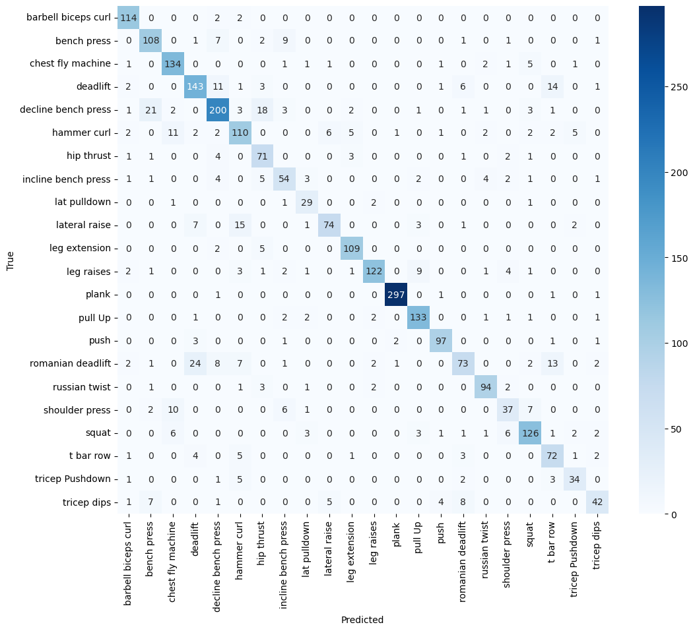
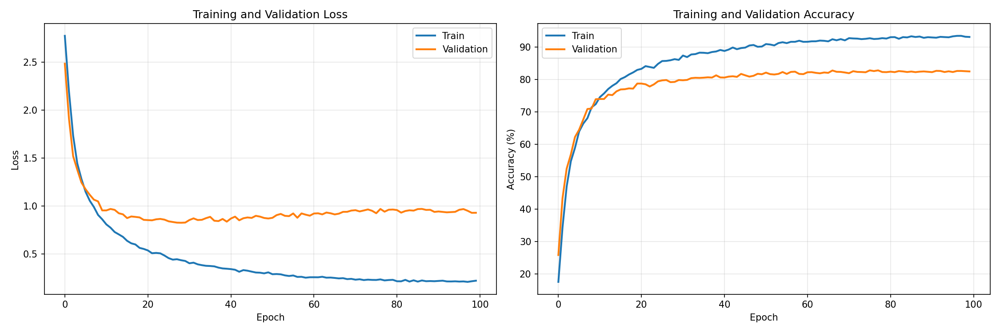

# Exercise Counter ML — Real-time Exercise Classification on Mobile Devices


> **LightGBM and Custom CNN for real-time exercise classification on mobile devices. Both models achieve >82% accuracy on 22 classes with <100ms inference.**

## Table of Contents
- [Overview](#-overview)
- [Dataset](#-dataset)
- [Methodology](#-methodology)
- [Model 1: LightGBM](#-model-1-lightgbm)
- [Model 2: Custom CNN](#-model-2-custom-cnn)
- [Comparison](#-comparison)
- [Installation](#-installation)
- [Usage](#-usage)
- [Project Structure](#-project-structure)
- [Future Work](#-future-work)
- [License](#-license)

---

## Overview

This project solves the problem of **real-time exercise classification on smartphones**. The goal is to recognize which exercise a user is performing from a video stream, with:
- **High accuracy** — reliable classification across 22 exercises
- **Low latency** — real-time performance on mobile devices

**Two approaches implemented and compared:**
- **LightGBM** — traditional gradient boosting on engineered features
- **Custom CNN** — deep learning with automatic feature extraction

## Dataset

**Source:** https://www.kaggle.com/datasets/hasyimabdillah/workoutfitness-video
**Classes:** 22 exercises 
**Split:** 80/20 train/test split **by video** (no data leakage)  
**Preprocessing:**
- Extract frames with skip frames option
- Segment into 10-frame windows (≈1.5 seconds)
- MediaPipe Pose → 33 keypoints (x, y, z)
- Filtered to 22 relevant body points

Table of exercises and support for test split

| Class | Support | Class | Support |
|-------|---------|-------|---------|
| barbell biceps curl | 99 | bench press | 88 |
| chest fly machine | 85 | deadlift | 81 |
| decline bench press | 141 | hammer curl | 105 |
| hip thrust | 98 | incline bench press | 64 |
| lat pulldown | 83 | lateral raise | 79 |
| leg extension | 149 | leg raises | 90 |
| plank | 259 | pull up | 118 |
| push-up | 111 | romanian deadlift | 79 |
| russian twist | 82 | shoulder press | 63 |
| squat | 130 | t bar row | 68 |
| tricep pushdown | 55 | tricep dips | 67 |

---

### Common Pipeline

1. **Pose Extraction** (MediaPipe)
   - 33 keypoints per frame (x, y, z coordinates)
   - Temporal smoothing via sliding windows
   - Filtered to 22 points (removed face/hands)
   - Augmentations ready

2. **Feature Engineering**
   - Raw coordinates as features
   - Temporal windows of 10 frames
   - Final feature vector per sample: `22 points × 3 coords × 10 frames = 660 features`

3. **Train/Test Split**
   - Split by video (no data leakage)
   - 80% train / 20% test

---

## Model 1: LightGBM

### Architecture
- Gradient boosting on decision trees with GridSearch and cross-validation
- 660 input features
- Multi-class classification with softmax objective

### Hyperparameters
```python
params(
    random_state=42,
    n_jobs=-1,
    verbose=1,
    importance_type='gain',
    objective='multiclass',
    class_weight='balanced'
)
```
Hyperparams grid:
```python
param_grid_small = {
    'num_leaves': [31, 63],
    'max_depth': [5, 7],
    'learning_rate': [0.05, 0.1],
    'n_estimators': [100, 200]
}
```

### Results

| Class               | Precision | Recall | F1-score | Support |
|---------------------|----------|--------|----------|---------|
| barbell biceps curl | 0.66 | 0.76 | 0.71 | 99 |
| bench press         | 0.70 | 0.64 | 0.67 | 88 |
| chest fly machine   | 0.80 | 0.91 | 0.85 | 85 |
| deadlift            | 0.69 | 0.74 | 0.71 | 81 |
| decline bench press | 0.80 | 0.86 | 0.83 | 141 |
| hammer curl         | 0.73 | 0.65 | 0.69 | 105 |
| hip thrust          | 0.85 | 0.93 | 0.89 | 98 |
| incline bench press | 0.66 | 0.80 | 0.72 | 64 |
| lat pulldown        | 0.80 | 0.67 | 0.73 | 83 |
| lateral raise       | 0.90 | 0.76 | 0.82 | 79 |
| leg extension       | 0.96 | 0.90 | 0.93 | 149 |
| leg raises          | 0.82 | 0.83 | 0.82 | 90 |
| plank               | 0.98 | 0.98 | 0.98 | 259 |
| pull Up             | 0.90 | 0.75 | 0.81 | 118 |
| push-up             | 0.99 | 0.90 | 0.94 | 111 |
| romanian deadlift   | 0.65 | 0.65 | 0.65 | 79 |
| russian twist       | 0.95 | 0.98 | 0.96 | 82 |
| shoulder press      | 0.74 | 0.81 | 0.77 | 63 |
| squat               | 0.81 | 0.90 | 0.85 | 130 |
| t bar row           | 0.77 | 0.78 | 0.77 | 68 |
| tricep Pushdown     | 0.89 | 0.89 | 0.89 | 55 |
| tricep dips         | 0.68 | 0.64 | 0.66 | 67 |

| Metric        | Precision | Recall | F1-score | Support |
|-------------|----------|--------|----------|---------|
| accuracy     | — | — | 0.82 | 2194 |
| macro avg    | 0.81 | 0.80 | 0.80 | 2194 |
| weighted avg | 0.83 | 0.82 | 0.82 | 2194 |



### Results Analysis

Table of per-class performance shows that plank, push ups, russian twists and leg extensions got the highest f1-score, possibly due to high support and unique and distinct poses when performing these exercises.

Confusion matrix shows that some of the low scored exercises (romanian deadlift - deadlift; hammer curl - barbell biceps curl; bench press - incline bench press) are most likely to be confused with each other due to very similar movement and positions.

It also should be noted that bench press poor score can be related to the fact that it's usually performed with a spotter, so mediapipe pose exctraction can take pose features of the spotter instead of target person. That issue can be seen in the 01-feature-exctraction notebook.

This issue can be solved with bigger dataset, as most of the low-scored exercises have low support.

## Model 2: Custom CNN

### Architecture

The idea is to use compact and effective structure, using depthwise convolutions, but instead of images, I used tensor of landmark-time dimensions, and the coords dimension was used as the channel dimension.
Designed specifically for the (3, 10, 22) tensor format (channels×time×landmarks):

Input: (batch, 3, 10, 22)  # (dimensions, time, landmarks)
    │
    ├─ MultiScaleTemporalBlock(3 → 30)
    │   ├─ dilation=1 conv (local patterns)
    │   ├─ dilation=2 conv (medium patterns)
    │   ├─ dilation=3 conv (long patterns)
    │   └─ concat + mix
    │
    ├─ DepthwiseSeparableBlock(30 → 64, stride=1)
    ├─ DepthwiseSeparableBlock(64 → 128, stride=2)
    ├─ SpatialDropout(0.3)
    ├─ DepthwiseSeparableBlock(128 → 256, stride=2)
    ├─ DepthwiseSeparableBlock(256 → 256, stride=2)
    ├─ SpatialDropout(0.3)
    │
    ├─ Global Average Pooling
    ├─ Dropout(0.3)
    └─ Fully Connected (256 → 22) (three heads)

### Model Size
- Total parameters: 169k
- Model size: 2.0 MB

### Results

| Class               | Precision | Recall | F1-score | Support |
|---------------------|----------|--------|----------|---------|
| barbell biceps curl | 0.88 | 0.97 | 0.92 | 118 |
| bench press         | 0.76 | 0.83 | 0.79 | 130 |
| chest fly machine   | 0.82 | 0.91 | 0.86 | 148 |
| deadlift            | 0.77 | 0.79 | 0.78 | 182 |
| decline bench press | 0.82 | 0.78 | 0.80 | 257 |
| hammer curl         | 0.72 | 0.73 | 0.73 | 151 |
| hip thrust          | 0.66 | 0.85 | 0.74 | 84 |
| incline bench press | 0.68 | 0.69 | 0.68 | 78 |
| lat pulldown        | 0.69 | 0.85 | 0.76 | 34 |
| lateral raise       | 0.86 | 0.72 | 0.78 | 103 |
| leg extension       | 0.90 | 0.94 | 0.92 | 116 |
| leg raises          | 0.94 | 0.82 | 0.88 | 148 |
| plank               | 0.99 | 0.99 | 0.99 | 301 |
| pull Up             | 0.88 | 0.92 | 0.90 | 144 |
| push                | 0.92 | 0.92 | 0.92 | 105 |
| romanian deadlift   | 0.75 | 0.54 | 0.63 | 136 |
| russian twist       | 0.89 | 0.90 | 0.90 | 104 |
| shoulder press      | 0.66 | 0.59 | 0.62 | 63 |
| squat               | 0.84 | 0.83 | 0.83 | 152 |
| t bar row           | 0.67 | 0.81 | 0.73 | 89 |
| tricep Pushdown     | 0.76 | 0.74 | 0.75 | 46 |
| tricep dips         | 0.78 | 0.62 | 0.69 | 68 |

| Metric        | Precision | Recall | F1-score | Support |
|-------------|----------|--------|----------|---------|
| accuracy     | — | — | 0.82 | 2757 |
| macro avg    | 0.80 | 0.81 | 0.80 | 2757 |
| weighted avg | 0.83 | 0.82 | 0.82 | 2757 |




### Results Analysis

This model has a lot of overtraining, even with dropout.
In comparison with LightBGM, it has less confusion with similar exercises, and most of the low scored classes are due to low support. With bigger dataset this model could achieve better results.
